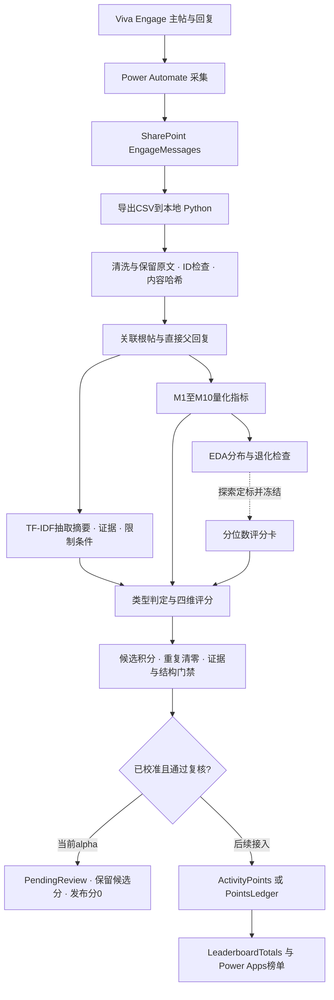

# PART2：量化评分卡 v0.2-alpha 实现与62条记录试评分

日期：2026-09-28。实现之前计划的 P-EDA0：10指标、EDA、分位数卡与本地试评分。

**当前完成的是探索版评分卡与工程验证。没有人工金标准，未完成E1/E2正式定标；候选分可查看，62条均待复核，可发布积分为0。**

## 1. 完整评分流程



实跑范围是本地CSV至复核输出。图中下游写回和榜单发布是后续接口，本次没有操作云端。

## 2. 模型变化与可复算规则

- 保留原 rules 和弱监督 ml 后端；新增 scorecard 后端，使用同一 evaluate(message, summary, ctx) 接口。
- 十指标：有效字数、段落数、段均字数、代码块数、外链数、每百字数字信号、方法步骤、疑问信号、主帖线程回复数、实践/答疑暗示。URL中的编号不计数字信号；回复的M9为0。
- 每指标先log1p，再保存P25/P60/P90切点。大于切点才升级，零值为L0，重复切点合并；无方差指标退出维度合成。每个维度对有效指标等级等权平均，再四舍五入到0–3。
- value用M1/M2/M3，evidence用M4/M5/M6，discussion_impact用M7/M9；M8/M10辅助类型判断。段均字数不是语义信息密度。relevance缺少有效量化指标，暂用主题/父帖规则代理，并明确标记复核。
- 防止纯篇幅获益：没有具体操作信号的value封顶L1；带操作的答疑至少L1；普通互动四维为0。这些仍是启发式护栏，不是已验证的语义质量判断。
- alpha候选积分 = floor(10 × 四维等级之和 / 12 + 0.5)，范围0–10，去掉类型基础分以缓解封顶。相同作者同正文的所有记录继续按既有政策清零。
- 置信值为规则强度，不是统计概率。alpha统一PendingReview，points=0，candidate_points保留诊断值。
- 修正MessageId父回复查找及跨NetworkId线程隔离；拒绝重复MessageKey。摘要新增原文限制片段；门禁检查四维范围与证据回指。

## 3. 数据与实际结果

原12条含11条测试帖和1条真实观点帖；新增50条全是模拟素材。62条用于探索切点和回代试评分，没有独立测试集；作者设计标签只在评分完成后作描述对照，未输入模型。

| 数据组 | 条数 | 旧规则积分合计 | alpha候选积分合计 | 可发布积分 | 类型变化 | 重复清零 | 旧/新满分条数 | 门禁通过 |
|---|---:|---:|---:|---:|---:|---:|---:|---:|
| existing_anonymized_capture | 12 | 71 | 15 | 0 | 7 | 4 | 6/0 | 12 |
| synthetic_forvia_v1 | 50 | 394 | 137 | 0 | 22 | 2 | 20/0 | 50 |

原12条旧规则积分合计与已保存结果一致：True。
模拟50条与作者设计类型的一致数：旧规则 29/50；alpha 33/50。这不是人工标注准确率，也不是泛化能力提升的证据。
分数变化体现了评分规则改变；不能把分数降低或满分减少本身当作评分更准确。门禁通过仅说明结构和引用可回指，不保证事实正确。

本次自动化测试：10项通过（7项新增评分测试、3项既有排行榜测试）。覆盖父回复/网络隔离、数字与URL区分、零方差及相同切点、复核冻结、重复处理、辅助标签不泄漏、摘要限制保留、重复主键拒绝、评分卡冻结。CLI评分入口也已实跑62条。

### 指标退化情况

| 分组 | 无方差指标 |
|---|---|
| all | M4_code_blocks |
| origin:existing_anonymized_capture | M4_code_blocks, M5_urls, M8_questions |
| origin:synthetic_forvia_v1 | M2_paragraphs, M4_code_blocks |

## 4. 逐条评分

四维顺序：相关性/价值/证据/讨论推进。完整理由、指标和摘要见 examples/quant_validation/artifacts_scorecard.json；CSV见同目录scores_comparison.csv。所有记录状态均PendingReview。

| 记录 | 标题 | 旧类型→新类型 | 四维等级 | 旧积分 | 候选分 | 重复 |
|---|---|---|---|---:|---:|---|
| 原01 | 9/18 test | social→practice_share | 2/0/1/0 | 0 | 0 | 是 |
| 原02 | 2026年9月17日，Hello World! | social→social | 0/0/0/0 | 5 | 0 |  |
| 原03 | Open AI 推出面向法律工作的 Astra for law，将GPT-6 Astra 与法律检索、专业工作流程结合， | practice_share→practice_share | 2/1/1/1 | 10 | 4 |  |
| 原04 | 9/18 test | social→practice_share | 2/0/1/1 | 0 | 0 | 是 |
| 原05 | [QA-ENGAGE-20260920][TC10-Reply]
 这是对测试主帖的回复，用于验证 ThreadId 和 | social→answer | 2/1/1/0 | 6 | 3 |  |
| 原06 | [QA-ENGAGE-20260920][TC07-Duplicate]
 这是完全相同正文的第一次发布。 | practice_share→social | 0/0/0/0 | 0 | 0 | 是 |
| 原07 | [QA-ENGAGE-20260920][TC07-Duplicate]
 这是完全相同正文的第一次发布。 | practice_share→social | 0/0/0/0 | 0 | 0 | 是 |
| 原08 | TC06：空白行和近似空正文

 在 Viva Engage 发布：

 [QA-ENGAGE-20260920][ | practice_share→social | 0/0/0/0 | 10 | 0 |  |
| 原09 | TC05：超长文本

 在 Viva Engage 发布以下开头后，重复复制“长文本内容”段落，建议总长度达到 3,0 | practice_share→practice_share | 0/3/1/0 | 10 | 3 |  |
| 原10 | [QA-ENGAGE-20260920][TC04-Special]
 特殊字符测试：<tag> & "quotes"  | practice_share→practice_share | 0/1/1/0 | 10 | 2 |  |
| 原11 | [QA-ENGAGE-20260920][TC03-Newlines]
 第一段：这是第一段文本。

 第二段：中间有 | practice_share→social | 0/0/0/0 | 10 | 0 |  |
| 原12 | [QA-ENGAGE-20260920][TC02-Mixed]
 English + 中文 + 1234567890. | practice_share→practice_share | 2/1/1/0 | 10 | 3 |  |
| S01 | 座椅工艺文件检索：为什么搜到的是旧版本？ | question→question | 2/1/0/1 | 9 | 3 |  |
| S02 | 先确认适用范围 | social→answer | 2/1/0/1 | 7 | 3 |  |
| S03 | 补充一个版本冲突案例 | answer→question | 2/1/1/0 | 10 | 3 |  |
| S04 | 感谢分享 | social→social | 0/0/0/0 | 6 | 0 |  |
| S05 | 座椅面料外观检查：一次跨批次失败复盘 | practice_share→retrospective | 2/1/0/1 | 10 | 3 |  |
| S06 | 别把增强图片当独立样本 | answer→answer | 2/1/0/1 | 10 | 3 |  |
| S07 | 汽车需求工程 RAG：值得读的近期论文 | resource→resource | 2/1/1/2 | 10 | 5 |  |
| S08 | 中文提问能命中英文规范吗？ | question→question | 2/1/0/0 | 7 | 3 |  |
| S09 | 保留标识符，再做检索对照 | answer→question | 2/1/0/0 | 9 | 3 |  |
| S10 | ECU测试助手：通过率上升却没有更可靠 | practice_share→retrospective | 2/1/0/1 | 10 | 3 |  |
| S11 | 补一个容易漏掉的负例 | social→question | 2/1/0/0 | 6 | 3 |  |
| S12 | 灯具视觉检查：合成缺陷能替代实拍吗？ | question→question | 2/1/0/1 | 8 | 3 |  |
| S13 | 先评估复核工作量 | social→answer | 2/1/0/0 | 6 | 3 |  |
| S14 | 清洁出行试验记录摘要：单位不能消失 | practice_share→practice_share | 2/1/0/1 | 10 | 3 |  |
| S15 | 百分比和绝对值分开 | social→answer | 2/1/0/0 | 6 | 3 |  |
| S16 | 售后知识助手的中英混合问题 | question→question | 2/1/0/1 | 8 | 3 |  |
| S17 | Keep the fault code literal | social→answer | 2/2/0/0 | 6 | 3 |  |
| S18 | 尝试了保留原词的输出 | social→answer | 2/1/0/0 | 6 | 3 |  |
| S19 | 供应商文件OCR：表格读对了，关联却错了 | practice_share→retrospective | 2/1/0/1 | 10 | 3 |  |
| S20 | 跨页记录需要拒绝猜测 | social→answer | 2/1/0/0 | 6 | 3 |  |
| S21 | 本地摘要模型：先试推理模式还是普通模式？ | question→question | 2/1/0/1 | 9 | 3 |  |
| S22 | 先测冷启动和峰值内存 | social→question | 2/1/0/0 | 7 | 3 |  |
| S23 | 模拟结果：更快不等于可以验收 | question→question | 2/1/1/0 | 10 | 3 |  |
| S24 | 生产排程助手怎样避免输出不可执行计划？ | question→question | 2/1/0/1 | 8 | 3 |  |
| S25 | 把可行性与优化程度分开 | social→question | 2/1/0/1 | 6 | 3 |  |
| S26 | 能耗分析：总用电下降不一定代表效率提升 | practice_share→practice_share | 2/1/0/1 | 10 | 3 |  |
| S27 | 先确认分母 | social→answer | 2/1/0/1 | 4 | 3 |  |
| S28 | 跨语言论坛摘要会不会丢掉‘尚未验证’？ | question→question | 2/1/0/1 | 8 | 3 |  |
| S29 | 给摘要增加状态字段 | answer→question | 2/1/0/0 | 10 | 3 |  |
| S30 | 长讨论串：关键限制藏在中间怎么办？ | practice_share→question | 2/1/0/1 | 10 | 3 |  |
| S31 | 建议连评分一起比较 | social→answer | 2/1/0/0 | 6 | 3 |  |
| S32 | 论坛评分不要把长文自动当高贡献 | practice_share→question | 2/2/1/1 | 10 | 5 |  |
| S33 | 评分理由也要核对原文 | question→question | 2/1/0/0 | 6 | 3 |  |
| S34 | 智能体评测阅读：让验收集更难被钻空子 | question→question | 2/2/1/1 | 10 | 5 |  |
| S35 | 已记录到验证清单 | social→social | 0/0/0/0 | 4 | 0 |  |
| S36 | AI赋能制造的全面思考 | practice_share→practice_share | 2/1/0/0 | 10 | 3 |  |
| S37 | 一个我还没有验证的想法 | practice_share→question | 2/1/0/0 | 9 | 3 |  |
| S38 | 周末跑步打卡 | social→social | 0/0/0/0 | 4 | 0 |  |
| S39 | 用两个样例证明所有模型都可靠？ | practice_share→practice_share | 2/1/1/1 | 10 | 4 |  |
| S40 | 两个答对只说明这两个答对 | answer→answer | 2/1/1/0 | 10 | 3 |  |
| S41 | 重复素材测试：保留版本号 | practice_share→question | 2/0/0/1 | 0 | 0 | 是 |
| S42 | 重复素材测试：再次发布 | practice_share→question | 2/0/0/0 | 0 | 0 | 是 |
| S43 | 增加一个不同的验证点 | social→social | 0/0/0/0 | 7 | 0 |  |
| S44 | 评分输入中的指令干扰样例 | practice_share→practice_share | 2/1/0/0 | 10 | 3 |  |
| S45 | 只有链接的资料转发 | resource→resource | 0/1/1/0 | 10 | 2 |  |
| S46 | SharePoint导出进入本地摘要：一条容易漏的规则 | practice_share→practice_share | 2/1/0/1 | 10 | 3 |  |
| S47 | 清洗后别把否定句删了 | answer→answer | 2/1/0/0 | 9 | 3 |  |
| S48 | 一句话改写也可能改变证据等级 | practice_share→practice_share | 2/0/0/0 | 9 | 2 |  |
| S49 | 同一实验主题的完成状态样例 | practice_share→practice_share | 2/1/0/0 | 10 | 3 |  |
| S50 | 给AI培训设计一份失败案例作业 | question→question | 2/1/0/0 | 8 | 3 |  |

## 5. 验证边界与下一阶段

- 本次不计算p值、人工一致性κ或模型真实准确率：独立真实记录及双标注尚缺。合成50条不能满足真实帖≥30或标注100–200条的要求。
- 类型规则仍会混淆讨论中的反问与真正提问、资源分享与实践；见design_disagreements.csv。长文护栏也可能误伤没有动作词的有价值分析。
- 回复数依赖当前导出覆盖范围，后续新增回复会改变该指标与候选分，不能解读为固定的个人质量。
- 数字和URL仅是具体性信号，不能证明实验真实或文献可靠；操作词不是实际可执行性的证明。摘要限制词抽取仍会遗漏表达变体。
- 当前M4代码块全零，无法评价其区分力；M5分位切点全部为零且合并为一个，链接信号最多只到L1。这是稀疏样本分布的限制，后续应对离散指标单独定标。
- 下阶段按原计划：真实记录积累→双人盲标→类型κ/四维加权κ→按线程与重复族隔离探索和验证集→分位数敏感性与效度分析→正式定权与发布。

## 6. 复现

```powershell
python -m venv .venv
.\.venv\Scripts\python.exe -m pip install -r requirements.txt
.\.venv\Scripts\python.exe tools/run_quant_validation.py
.\.venv\Scripts\python.exe -m pytest -q
.\.venv\Scripts\python.exe -m poc.run_poc examples/forvia_materials/EngageMessages_merged_62.csv --model scorecard --card examples/quant_validation/scorecard.json --out poc_output/scorecard
```

实跑版本：Python 3.12.9；numpy 2.5.3；scipy 1.18.1；scikit-learn 1.9.1。
