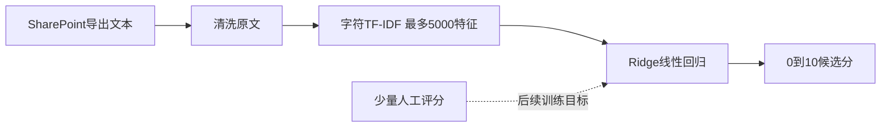

# 轻量文本评分：TF-IDF＋Ridge 可行性验证

日期：2026-09-28。目标：普通个人电脑、CPU运行、无需下载大模型。选择scikit-learn的经典稀疏文本特征与线性回归。项目原有弱监督模型已经使用Ridge，本次缩减为一个仅预测0—10分的独立小脚本，并补上分组交叉验证和性能实测。

## 方法



TF-IDF将经常一起出现的2—4个字符转换为稀疏数值，Ridge学习这些特征与分数的关系。字符特征直接支持中文，不需要下载分词模型。当前仅使用帖子正文，不输入姓名、作者设计标签、既有分数或来源字段；不分析附件，也不生成摘要或事实核验结论。

这是一种成熟开源算法组合，不是已经训练好的员工评价模型。它能够从标注样例学习评分习惯；面对反讽、复杂推理、证据真假和新领域时能力有限。

官方资料：[TfidfVectorizer](https://scikit-learn.org/stable/modules/generated/sklearn.feature_extraction.text.TfidfVectorizer.html)、[Ridge](https://scikit-learn.org/stable/modules/generated/sklearn.linear_model.Ridge.html)、[GroupKFold](https://scikit-learn.org/stable/modules/generated/sklearn.model_selection.GroupKFold.html)。

## 本机实测

机器：Intel Core Ultra 5 125H，约32GB物理内存。数值库限制为1线程。样本62条、5000个特征；这不是在另一台三年前电脑上的实测，也不是大数据量压力测试。

| 项目 | 本次结果 |
|---|---:|
| 全量训练 | 0.019秒 |
| 5折分组交叉验证 | 0.119秒 |
| 62条批量预测，20次平均 | 8.209毫秒 |
| 平均每条预测 | 0.132毫秒 |
| 压缩模型文件 | 50,496字节，约49.3KiB |
| 独立线程/完全重复文本组 | 35组 |
| 对现有弱标签的分组验证MAE | 0.937 / 10分 |
| 每折训练均值基线MAE | 0.980 / 10分 |

计时不含Python启动、库导入；模型文件大小不等于运行内存，未测量进程峰值内存。根据本次耗时与稀疏模型规模，普通旧电脑运行当前规模预计负担较低，但不能据此承诺任意规模和硬件的速度。

**运行可行；评分效果仍未得到人工标准验证。** 相比均值基线，MAE仅改善约0.043分，当前学习信号很弱，不足以认定模型已能理解贡献质量。

## 验证口径

- 训练目标是现有alpha评分卡四维之和换算到0—10分，使用重复惩罚之前的值；这避免让文本模型学习“相同正文因重复而归零”的业务规则。
- 当前12条抓取样例含11条测试帖，另50条是模拟素材。这些规则分是弱标签，不是人工金标准。
- 同线程及完全相同的标准化正文放在同一折；每折独立拟合词表和IDF。未自动识别全部近似改写，合成样例之间仍可能相关。
- 评分卡本身先前在同62条上探索定标，当前CV只衡量对既有弱标签的模仿；不构成独立的真实业务评分验证。
- `OutOfFoldScore`是未在该条所在组训练的预测，适合看误差；`FittedScore`是全量拟合后的回代结果，不能作为准确率。
- 重复惩罚、人工复核和发布规则应留在下游。本脚本只导出Experimental结果，没有写回SharePoint。

## 一条命令复现

在项目根目录运行已有虚拟环境：

```powershell
.\.venv\Scripts\python.exe -X utf8 -m poc.simple_score
```

默认输出：`poc_output/simple_score/model.joblib`、`scores.csv`、`report.json`。本次可复查的62条结果保存在 `examples/simple_score_results/`，逐条技术文档为 [全部正文评分结果](PART2_SIMPLE_MODEL_ALL_MESSAGES.md)。再次运行会更新指定实验目录；要保留多次实验，使用不同的`--out`。

## 下一次如何真正验证改进

先给20—30条有差异的帖子人工打0—10总分（仅是小试起点，不是正式统计定标），保存到`data/human_scores.csv`：

```csv
MessageKey,HumanScore
```

每条填写实际MessageKey和真实评阅分数；不预填模型分数。文件可只包含已评阅记录，空分数跳过。然后运行：

```powershell
.\.venv\Scripts\python.exe -X utf8 -m poc.simple_score --labels data/human_scores.csv --out poc_output/simple_score_human
```

脚本会自动训练并重新做分组验证，同时给出均值基线。先看是否稳定优于均值基线，再看误差最大的原帖是否有明确原因。正式定标仍按原计划积累真实样本和双人标注；不要为追求测试分数反复修改同一验证集。
