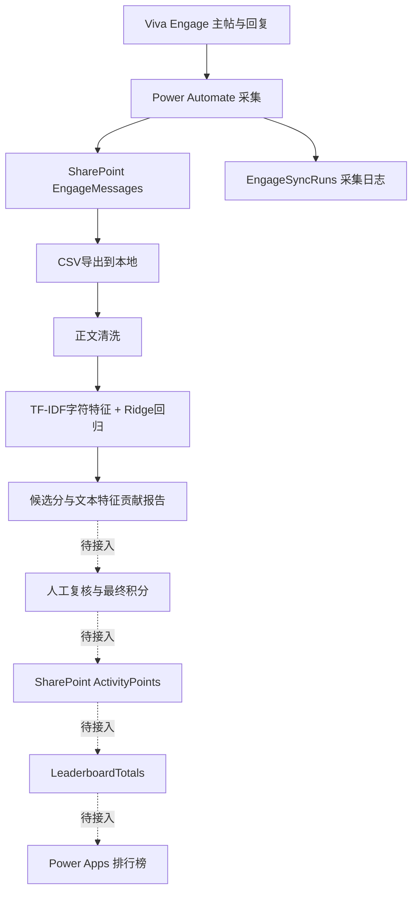

# AI Talent Show：AI论坛活动评分

## 公司电脑展示入口

拉取仓库后，双击根目录 **`打开项目汇报.cmd`**，或用 Edge / Chrome 打开 [可视化汇报](docs/AITALENTSHOW_FEASIBILITY_REPORT.html)。页面和三张结构图随仓库保存，离线可读，无需 Python 或本地服务器。

展示步骤、500字以内介绍及可选运行命令见 [公司电脑展示说明](SHOWCASE.md)。完整证据见 [可行性分析文字稿](docs/AITALENTSHOW_FEASIBILITY_REPORT.md)。

面向FORVIA AI论坛活动积分、激励与培训反馈。当前主线使用 SharePoint / Power Automate 管理业务数据，本地 Python 的 **TF-IDF＋Ridge** 负责轻量文本评分。

## 整体架构



本地已实跑62条记录的训练、评分、分组验证和逐条报告。上游已有抓取样例；本次整理未重新核验云端采集状态。下游汇总函数已经实现，模型到正式积分的转换、SharePoint写回和Power Apps联调尚未完成。

## 三部分职责

| 部分 | 负责什么 | 主要入口 | 状态 |
|---|---|---|---|
| 采集 | 消息和采集日志进入SharePoint | `agent.md` | 已有导出样例；云端状态需现场确认 |
| 评分 | 本地清洗、训练/试评分、解释与验证 | `poc/simple_score.py` | 62条已验证；独立新帖推理入口待补 |
| 发布 | 确认最终积分，按人和周期汇总展示 | `poc/leaderboard.py` | 汇总函数及建表说明已具备；写回和应用待联调 |

模型直接读取正文。摘要、贡献类型识别和四维评分卡退出当前主流程，保留作历史对照。当前实验训练分数仍来自评分卡的已有输出，后续由人工标签替换。

## 最小数据结构

- `EngageMessages`：原文、作者、时间、消息键和线程关系。
- `EngageSyncRuns`：采集批次状态。
- `ActivityPoints`：拟作为复核后的最终积分来源；先确认实际列表和字段。
- `LeaderboardTotals`：由有效积分生成的周期汇总。

只有已有ActivityPoints无法满足审计和版本需求时，才使用PointsLedger补齐。当前轻量模型不要求先建立摘要表或语义评估表。

## 运行入口

```powershell
# 已有虚拟环境：训练并评分现有样本
.\.venv\Scripts\python.exe -X utf8 -m poc.simple_score

# 重现完整62条报告，会更新指定实验目录
.\.venv\Scripts\python.exe -X utf8 -m poc.simple_score --out examples/simple_score_results
.\.venv\Scripts\python.exe -X utf8 tools/make_simple_score_report.py
```

新环境先运行 `python -m venv .venv`，再运行 `.\.venv\Scripts\python.exe -m pip install -r requirements.txt`。

脚本目前每次运行都会训练模型。`--labels data/human_scores.csv`接受 `MessageKey,HumanScore`；未指定时使用已有规则弱标签。输入新CSV中没有匹配标签的行会被过滤，当前命令不能当作日常新帖推理服务。

## 推荐阅读顺序

1. 本页：总架构与状态。
2. [第二部分：精简评分流程](PART2_LIGHTWEIGHT_OVERVIEW.md)：输入、处理、输出和发布边界。
3. [62条正文及评分原因](PART2_SIMPLE_MODEL_ALL_MESSAGES.md)：逐条结果。
4. [轻量模型可行性报告](PART2_SIMPLE_MODEL_POC.md)：性能与人工标签接入。
5. [SharePoint建表步骤](PART3_SHAREPOINT_LISTS_STEP_BY_STEP.md)：实施下游时使用。

详细采集字段见 [agent.md](agent.md)，汇总接口见 [排行榜实现契约](PART3_LEADERBOARD_IMPLEMENTATION.md)。

## 各部分完整指导文档（保留）

| 部分 | 指导文档 | 使用方式 |
|---|---|---|
| 第一部分：采集 | [agent.md](agent.md)、[Viva Engage测试用例](VivaEngage_测试用例.txt) | 采集配置、字段映射与联调检查 |
| 第二部分：处理与评分 | [完整流水线设计](PART2_TEXT_PIPELINE.md)、[原POC报告](PART2_POC_REPORT.md)、[量化验证计划](PART2_QUANT_SCORING_PLAN.md) | 详细设计、历史实验与标注计划；当前执行路线以轻量概览为准 |
| 第二部分：当前模型 | [轻量模型操作说明](PART2_SIMPLE_MODEL_POC.md)、[全部评分结果](PART2_SIMPLE_MODEL_ALL_MESSAGES.md)、[评分卡实验报告](PART2_SCORECARD_VALIDATION.md) | 复现、查看结果和对照 |
| 第三部分：积分与展示 | [逐步建表指南](PART3_SHAREPOINT_LISTS_STEP_BY_STEP.md)、[排行榜实现契约](PART3_LEADERBOARD_IMPLEMENTATION.md) | 建表、字段、权限与下游接口 |

精简仅收敛当前主线和阅读入口。各部分详细指南保留原文件路径，代码与历史结果保留用于复查。

## 下一步

1. 先补20—30条人工分数做小试，检验是否优于均值基线；正式定标继续积累真实数据和双人标注。
2. 增加加载冻结模型处理新帖的入口，保留消息键、模型版本和内容变更标识。
3. 实现复核结果→ActivityPoints→LeaderboardTotals→Power Apps闭环。Experimental预测不能直接当作Published积分。

## 历史与辅助模块

| 文件 | 保留用途 |
|---|---|
| `poc/baseline.py`、`run_poc.py` | 原抽取摘要与规则评分对照 |
| `poc/features.py`、`train.py`、`ml_model.py` | 原多输出弱监督实验 |
| `poc/eda.py`、`scorecard.py` | 10指标EDA与评分卡实验；现有弱标签来源 |
| `PART2_QUANT_SCORING_PLAN.md` | 数据积累和人工验证计划，非当前必跑链路 |
| `PART2_POC_REPORT.md`、`PART2_SCORECARD_VALIDATION.md` | 已有实验记录 |
| `docs/archive/PART2_TEXT_PIPELINE_v1.md` | 原完整摘要与四维评分架构备份 |

相关模块互有引用，保留代码用于复现历史结果。`data/`、`poc_output/`、`.venv/`继续不入库。
