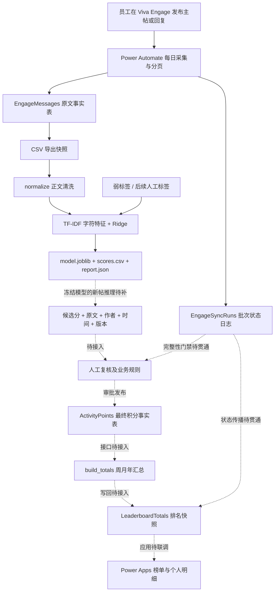
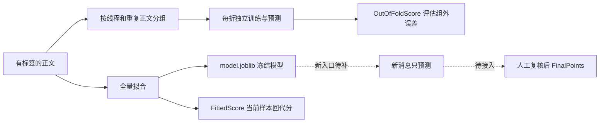
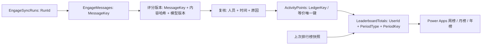

# AI Talent Show 全流程可行性分析汇报

汇报日期：2026年9月29日｜依据：当前项目文件、代码、实验产物与本地复验

## 1. 核心结论与实施建议

**项目具备推进受控试点的技术基础；记录、候选评分、排名计算分别已有设计或实现，但尚未形成可直接发布员工积分的生产闭环。** 当前适合采用“自动记录 → 模型辅助评分 → 人工确认 → 版本化积分 → 排行榜”的路线。正式上线的重点是评分标准、复核发布接口与数据治理，不是增加模型规模。

本汇报按 README.md 与 PART2_LIGHTWEIGHT_OVERVIEW.md 确定当前路线：正文直接进入 TF-IDF＋Ridge，生成0—10候选分；摘要、类型识别、四维评分属于历史实验与标签来源。下游部分文档仍引用旧积分引擎，应在实施前统一接口。

- **记录环节：已有采集证据，需重新核验云端。** agent.md 的9月20日状态为建表完成、云端联调待执行；PART2_POC_REPORT.md 记录9月22日已有每日采集和12条导出。后者时间更晚，但本次没有登录 SharePoint 或查看当前运行历史，不能据此宣称9月29日持续稳定运行。
- **打分环节：本地工程可行，业务有效性待验证。** 62条样本、35个线程/重复正文关联组的训练、分组验证及解释输出可以复现；当前目标仍是规则弱标签。
- **排名环节：聚合函数已实现，发布系统待接入。** poc/leaderboard.py 已计算周/月/年总分与顺序名次；ActivityPoints 写回、榜单快照发布、权限和 Power Apps 尚无完成闭环的项目证据。
- **建议决策：批准分阶段试点。** 第一阶段保留全量人工复核，只在隔离的测试积分中验收写回与展示；评分稳定性、状态门禁及权限通过验收后再开放正式榜单。

本地复验结果：13项现有测试全部通过。测试通过覆盖既有用例，不代表云端采集、真实评分质量或端到端发布已经通过验收。

## 2. 整体结构图：业务层、数据层与发布边界

图中实线表示已有设计且具有样例或本地实现的关系，不代表全部已经云端部署；虚线表示待接入的生产环节。



各层职责清晰：Viva Engage 负责员工贡献的发生；SharePoint 保存可追溯业务记录；Python 产生候选评分及汇总；人工对最终积分负责；Power Apps 展示已发布结果。Power Automate 承担调度、传输和写回，不另造一套评分公式。

PointsLedger 是条件性补充：先核对 ActivityPoints 是否具备状态、版本和复核审计能力；若足够，直接使用 ActivityPoints。若不足再补建审计层，避免两个列表同时维护互相冲突的最终分数。

## 3. 具体文件如何流转

| 环节 | 具体文件或列表 | 输入与处理 | 输出与后续用途 | 当前证据 |
|---|---|---|---|---|
| 采集规范 | agent.md；VivaEngage_测试用例.txt | 社区主帖、回复、references；映射作者及线程 | EngageMessages、EngageSyncRuns | 手册及历史导出；未复查当前云端 |
| 上游结构核查 | tools/read_list_schema.py | 登录后读取实际列表结构 | 核对内部字段名、类型等 | 工具存在；本次未调用云端 |
| 原始样例 | examples/EngageMessages_sample.csv | 12条匿名化抓取记录 | 供本地复现及合并 | 11条测试帖、1条观点帖 |
| 模拟素材 | examples/forvia_materials/materials.json；tools/build_forvia_materials.py | 50条模拟主帖/回复 | EngageMessages_synthetic_50.csv、MATERIALS_50.md | 场景和内容关系可检查 |
| 当前训练输入 | examples/forvia_materials/EngageMessages_merged_62.csv | 原12条＋模拟50条，保留来源字段 | simple_score.py 的默认输入 | 62条混合验证集 |
| 清洗 | poc/preprocess.py::normalize | NFC、换行、控制字符、HTML实体、空白归一 | 清洗后的正文字符串 | 当前轻量模型调用此函数 |
| 默认标签 | examples/quant_validation/artifacts_scorecard.json | 四维等级求和×10/12，重复惩罚前 | TargetScore | 弱标签，非独立人工评分 |
| 人工标签入口 | data/human_scores.csv（待形成） | MessageKey,HumanScore | 替代默认弱标签训练 | CLI 已支持；无已完成标注证据 |
| 训练与验证 | poc/simple_score.py | 线程/重复文本分组；每折独立拟合；全量训练 | model.joblib、scores.csv、report.json | 已实现并复验 |
| 逐条解释报告 | tools/make_simple_score_report.py | 按 MessageKey 关联正文与评分 | PART2_SIMPLE_MODEL_ALL_MESSAGES.md | 已有62条阅读版 |
| 复核发布适配 | 待实现；参考 PART2_LIGHTWEIGHT_OVERVIEW.md | 候选分＋原始字段＋复核意见 | 版本化 FinalPoints | 当前关键缺口 |
| 积分与榜单存储 | PART3_SHAREPOINT_LISTS_STEP_BY_STEP.md | 建表、唯一键、索引、权限 | ActivityPoints 或必要的 PointsLedger；LeaderboardTotals | 是实施指南，不是部署证明 |
| 排名计算 | poc/leaderboard.py::build_totals | 已批准/发布的最终积分＋上次快照 | 周/月/年汇总记录 | 纯本地函数已实现 |
| 员工展示 | PART3_LEADERBOARD_IMPLEMENTATION.md | LeaderboardTotals＋个人积分明细 | Power Apps 榜单 | 页面与接口规划待联调 |

**需要特别注意的接口断点：scores.csv 没有直接携带 SenderId、PostedAt、SourceUrl，也没有 FinalPoints、复核人和内容版本。** 它不能直接交给排行榜。必须先按 MessageKey 回联本次原始快照，校验一对一关系，再生成积分发布记录。不要按行号拼接；排序、过滤或重跑都会使行号失效。

当前轻量流程仅使用 normalize，并未调用完整 preprocess_message。因此历史实现里的 ContentHash、占位符、语言警告等不能直接视为当前评分输出已有的功能；需要的版本与变更字段应在发布适配层明确补齐。

## 4. 记录环节：从论坛正文到可追溯档案

依据 agent.md，目标社区为 Fight for Agentic，GroupId 为79121580033，NetworkId 为72938962945；目标站点为 AIPortal。业务ID全程保存为字符串，避免大整数精度丢失。

一次采集的设计流程为：每天北京时间08:00触发 → 创建运行日志 → 社区分页发现讨论串 → 拉取各串主帖与回复 → 字段映射 → 按 MessageKey 新增或更新 → 汇总本次成功/部分成功/失败状态。

| 源内容 | 入库字段 | 对后续评分/排名的作用 |
|---|---|---|
| network_id 与 id | MessageKey = NetworkId:MessageId | 全链路关联主键，避免重复入库 |
| body.plain | ContentText | 唯一评分文本来源；Title仅为预览 |
| sender_id 与 user引用 | SenderId、SenderName | 归属员工；名称不能充当稳定主键 |
| thread_id、replied_to_id | ThreadId、ReplyToId、IsRootPost | 回看上下文、分组验证、区分主帖与回复 |
| created_at | PostedAt | 决定积分所属业务周期 |
| web_url | SourceUrl | 人工复核时回看源帖 |
| 采集执行信息 | FirstCapturedAt、LastSeenAt、TextChangedAt、LastRunId | 追踪首次入库、再次看到、正文变更与来源批次 |

同一消息重复读取应更新原记录；正文变化后更新 TextChangedAt，并触发新评分版本。源消息本次未出现不等于删除，设计上保留存档。正文不下载附件、不做OCR，因此仅在图片或附件中出现的贡献可能被低估，活动说明需要明确当前计分覆盖范围。

记录层可行性的上线门槛包括：主帖与回复跨页完整性、采集日志可用、游标推进、超限时标记 Partial、实际时间列包含时分秒、业务键唯一、私有社区权限与存档访问一致。历史少量导出不能证明所有长讨论串都已完整采集。

另需区分两种数据：代码示例中的70000000001、模拟作者及 `.invalid` 地址属于匿名化/模拟样例，不是云端真实社区的可访问标识。

## 5. 打分环节：训练流程与日常流程必须分开

### 5.1 已实现的训练和验证

模型使用2—4字符组合的 TF-IDF，最多5000特征，Ridge 的 alpha=1，预测截断为0—10。仅正文参与模型输入；作者、姓名、来源标签不作为文本特征。回复的父帖虽然参与分组，当前模型并不读取父帖正文。

训练流程是：读取CSV → 读取规则弱标签或人工分数 → 仅保留具有标签的记录 → 将同线程和相同清洗正文合并分组 → 最多5折分组验证 → 全量训练 → 保存模型、当前样本回代分与特征贡献。



日常评分应加载经确认的冻结模型，对新增/修改消息生成候选分；不能每收到一条帖子就重新训练。当前 CLI 对没有匹配标签的行会过滤，因此直接传入新导出的CSV并不能构成新帖评分服务。

### 5.2 可复查的实验结果

本次2026年9月29日复验结果保存于 poc_output/feasibility_20260929/report.json，与归档样例在核心质量指标上一致。

| 指标 | 本次复验 | 解释 |
|---|---:|---|
| 消息数 / 分组数 | 62 / 35 | 12条抓取样例＋50条模拟；不等于62条真实贡献 |
| 分组验证MAE | 0.9370 / 10分 | 相对于规则弱标签的误差 |
| 每折训练均值基线MAE | 0.9799 / 10分 | 不读正文，仅输出训练均值 |
| MAE绝对改善 | 0.0429分 | 相对约4.37%；不足以证明业务评分有效 |
| 全量训练 | 0.0187秒 | 小样本实测 |
| 分组验证 | 0.1063秒 | 不包含进程启动与库导入 |
| 62条批量预测 | 7.253毫秒 | 20次均值 |
| 压缩模型大小 | 50,496字节 | 约49.3KiB，不等于运行内存 |
| 现有测试 | 13项通过 | 包含评分、评分卡和汇总测试 |

历史 PART2_SIMPLE_MODEL_POC.md 与 examples/simple_score_results/report.json 的耗时略有不同，属于不同运行结果。本汇报统一采用本次复验时间，不把多次运行的耗时拼成一次实验。

上述数据证明当前规模的CPU运行成本较低。未进行生产容量压测、峰值内存测量或租户许可核验，不能据此承诺大规模响应时间或零新增费用。

### 5.3 评分有效性与标签一致性

当前目标来自评分卡，验证主要说明模型模仿该评分卡的能力。训练目标也受当前62条探索数据影响，因此不是独立真实贡献的评估。FittedScore 是训练后回代值，不能当作模型准确率；特征贡献仅解释线性算分，不能证明内容正确、有用或证据真实。

项目中有一组很具体的限制：S41和S42来自同一模拟作者，ContentText 完全相同，但 TargetScore 分别为2.500和1.667，FittedScore 都为2.226，OutOfFoldScore 都为2.936。正文相同的模型必然给出相同分数，而标签却不同。该现象与历史评分卡包含线程等上下文信号相容，说明标签含有当前纯正文输入无法表达的差异。

处理建议：人工标注前明确“正文质量分”与“活动业务积分”分别如何定义。重复发布、周期封顶、员工资格等规则在下游执行；需要评价讨论推进或上下文相关性时，应由复核者读取父帖，或在后续模型方案中显式增加上下文。不要依靠调参解决输入信息缺失。

先用20—30条真实、差异明显的帖子开展人工评分小试，再按现有项目计划积累100—200条真实记录做双人标注和分组独立验证。验收阈值应在看验证结果前由活动负责人确定，包括允许误差、需强制复核的差异和排名稳定性。

## 6. 一条消息的完整流转：已有值与演示值分开

选取仓库模拟记录 S02“先确认适用范围”，其正文为：

> 先按车型、工厂、生效日期过滤；缺一项就追问。检索只在有效版本中进行，答案同时返回版本号和原文段落。

| 步骤 | 具体值 / 文件 | 发生的变化 |
|---|---|---|
| 原始记录 | EngageMessages_merged_62.csv；MessageKey=70000000001:5000000000002 | 保存完整正文与身份、时间 |
| 作者与关系 | SenderId=9100000000002；ThreadId=5000000000001；ReplyToId=5000000000001 | 归属模拟员工02，是对S01的回复 |
| 时间 | PostedAt=2026-09-28T01:02:00Z | 北京时间9月28日09:02 |
| 预处理 | normalize(ContentText) | 统一文本格式；保留原始记录 |
| 训练目标 | TargetScore=3.333 | 规则弱标签，非人工结论 |
| 分组验证 | OutOfFoldScore=2.437；Fold=1 | S01和S02保持同组，避免线程泄漏 |
| 全量回代 | FittedScore=2.943；Status=Experimental | 只是候选实验结果 |
| 线性解释 | Intercept=2.557；FeatureContribution=0.386 | 两者相加约2.943，存在导出舍入 |
| 复核发布（演示） | 假设复核者决定 FinalPoints=3，Approved，当前版本、非重复 | 这一步尚未实施；3分不是已获批准的真实分 |
| 汇总（演示） | UserId=9100000000002；Week=2026-W40；Month=2026-09；Year=2026 | 三个周期各增加3分，不是同一榜单计9分 |
| 页面展示（演示） | 从 LeaderboardTotals 读取该周期总分、名次 | 名次取决于同周期全部有效积分，不能仅凭这一条断定排名 |

以下为建议的最小跨层结构，包含待补字段；不是当前 scores.csv 原样输出：

```json
{
  "MessageKey": "70000000001:5000000000002",
  "UserId": "9100000000002",
  "PostedAt": "2026-09-28T01:02:00Z",
  "CandidateScore": 2.943,
  "FinalPoints": 3,
  "ScoringStatus": "Approved",
  "IsDuplicate": false,
  "IsCurrentVersion": true,
  "ModelVersion": "char-tfidf-ridge-1",
  "EvaluationVersion": "demo-evaluation-1",
  "RuleVersion": "demo-points-1",
  "SourceRunId": "demo-run"
}
```

该对象只演示字段流转。生产还应保留实际内容哈希、复核人、复核时间、原因、输入快照和发布批次；CandidateScore→FinalPoints 的取整及调整规则必须版本化。当前建表指南将积分列设为0位小数，而模型输出小数，不能交由存储端隐式取整。

## 7. 排名环节：从最终积分到员工榜单

### 7.1 已实现的计算逻辑

poc/leaderboard.py 的 build_totals 接收已算好的 FinalPoints（兼容 Points）。按 UserId 或 SenderId 归属员工，按 PostedAt 生成 ISO周、自然月、自然年。每个有效积分会进入三个独立周期视图。

- 有效性：ScoringStatus 为 Approved/Published，当前版本，非重复。
- 汇总：TotalPoints 为有效积分求和；PostCount 与 ContributionCount 目前都逐记录加一，未区分主帖/回复或独立贡献族。
- 排序：总分降序 → 最近得分时间升序 → 用户名升序；代码使用顺序名次1、2、3，不是同分并列名次。
- 前十：Rank≤10 标记 IsVisible=true；仍会为其他用户生成汇总数据。
- 变化：AddedPoints=当前总分−上次同一用户同一周期快照总分；RankDelta=上次名次−本次名次。AddedPoints 是“较上次刷新净变化”，不是整个周期新产生积分；撤分时可能为负。

### 7.2 需要贯通的数据关系与版本



建议使用 MessageKey|EvaluationVersion|RuleVersion 作为积分版本唯一键，且每个消息在相同活动口径下最多一个有效当前版本。现有 model.joblib 的版本字符串是固定名称，不能唯一标识每次训练；上线时另需训练批次、训练快照或模型文件摘要。

改帖→生成新候选版本→重新复核→旧版本失效→重算涉及的周/月/年榜单。人工撤销同理。汇总写回必须处理“已消失的用户/周期”：当某人的全部积分被撤销，本次函数不再产生其记录，仅更新本次返回行会让旧榜单残留。应按周期完整替换快照或显式失效旧行。

## 8. 主要缺口、具体证据与验收条件

下列问题来自代码检查和只在内存中运行的边界探测，未修改业务代码或云端数据。

| 优先级 | 缺口及具体证据 | 对业务的影响 | 上线前验收条件 |
|---|---|---|---|
| P0 | simple_score.main 每次训练；只保留有匹配标签的行 | 新帖可能被跳过，无法日常自动评分 | 冻结模型独立推理；无标签新帖可产候选结果 |
| P0 | scores.csv 无身份/周期/发布字段 | 无法直接形成可靠员工积分 | 按MessageKey回联快照，严格校验必填与版本 |
| P0 | leaderboard._valid 缺状态默认Published；缺当前标记默认True | 未审批记录误入榜 | 缺字段拒绝并记错误；Experimental/PendingReview拒绝 |
| P0 | bool("False")为True；探测传入IsDuplicate="False"后零条汇总 | 正常记录被误排除；其他标记也可能误读 | CSV布尔值显式解析；非法值拒绝 |
| P0 | 同一5分对象输入两次，汇总为10分 | 重跑/重复有效版本导致双计分 | 入口去重及唯一键；每消息当前版本唯一 |
| P0 | build_totals 没有接收批次状态，DataStatus固定Current | Partial数据被显示为完整榜单 | 传播采集/评分/写回状态；失败不替换已发布快照 |
| P0 | ActivityPoints写回、复核界面、Power Apps无闭环证据 | 候选分无法成为可审计公开积分 | 完成审批→写回→汇总→展示→撤销的演练 |
| P0 | 撤销后空周期不返回行；缺完整快照替换 | 旧名次、旧总分残留 | 撤销最后一条积分后旧汇总失效 |
| P0 | 前端IsVisible和Filter只是显示逻辑 | 普通用户可能直接读取底层不该访问的记录 | 列表/服务权限验证；公开榜与私密明细分界明确 |
| P1 | periods_for先转UTC；北京9月28日00:30被分入W39 | 北京时间周界附近归错周期，业务预期为W40 | 明确Asia/Shanghai业务日历，覆盖周/月/年跨界 |
| P1 | 弱标签、模拟样本占比高，S41/S42同文异标签 | 评分口径与正文可表达信息不一致 | 真实双标注，清理标签冲突，独立验证 |
| P1 | 模型小数分与列表整数分；旧文档要求基础/维度/类型 | 当前路线接口不匹配 | 统一取整规则及字段；无对应值不得伪造旧维度 |
| P1 | 顺序排名、用户名终极排序；完全相同排序键时无稳定ID兜底 | 并列政策不明，输入顺序变化可能影响名次 | 确认并列口径；增加稳定UserId兜底并测试 |
| P1 | 无FinalPoints数值范围/有限值的完整入口验证 | 异常值污染总分及排序 | 拒绝NaN/无穷/违规范围，撤分与调整另定规则 |

P0/P1 是本汇报的交付优先级建议。与上线安全、积分准确性相关的项目都应在正式发布前完成，不因列为P1而默认可带问题上线。

## 9. 分阶段落地、职责与资源可行性

| 阶段 | 工作与交付物 | 主要责任建议 | 放行标准 |
|---|---|---|---|
| A 记录核验 | 核对实际列表、字段、权限、时间精度、日志；执行跨页/改帖/重跑测试 | M365管理员＋流程维护人 | 能回溯一批完整消息；不完整批次明确标识 |
| B 人工评分小试 | 20—30条真实帖子独立人工打分；统一积分标准与例外 | 活动负责人＋评阅者 | 确认可执行评分标准，记录分歧和裁决 |
| C 推理与发布接口 | 新帖推理、快照回联、内容/模型版本、复核状态机、整数分规则 | Python维护人＋活动管理员 | 改帖、拒绝、重复、重跑不会误计分 |
| D 榜单联调 | ActivityPoints→build_totals→LeaderboardTotals→Power Apps | Python维护人＋M365/Power Apps维护人 | 周/月/年、排名变化、权限、撤分、失败恢复均通过 |
| E 受控试点 | 有限参与范围、全部人工确认、独立评分验证、运行监控 | 活动负责人 | 达到预定误差与复核工作量目标，再决定扩大 |

工程工作量主要集中在接口、状态、权限和恢复机制；算法计算本身在当前规模下不是瓶颈。人工工作量可按“每日待复核记录数×每条平均复核时长＋异常处理”估算。自动化请求量取决于社区页数、线程读取次数及逐条查询/写入次数，需用真实日批次记录测量，当前不宜给固定容量或费用承诺。

本汇报没有核验租户连接器、账号许可或服务配额，也没有新增任何云端部署。正式排期应以可用账号、真实内容量、人工评审安排及列表权限核验结果为依据。

## 10. 建议的闭环验收场景

1. 新主帖与回复：采集入库后按MessageKey回联，候选分进入复核；人工批准后仅计一次。
2. 同批重跑：原文不重复、积分版本不重复、同周期总分不变。
3. 改帖重评：候选版本变化，审批后旧积分失效，新分替换；历史记录可追溯。
4. 重复正文：候选分可以相同，业务重复判定及惩罚按规则执行；不将文字相同自动视为所有作者作弊。
5. 边界时间：北京时间周一00:30、月初与年初按已约定业务周期归属。
6. 未审批与坏字段：Experimental、PendingReview、缺状态、非法布尔、缺作者、非法分值不进入榜单。
7. Partial/Failed：阻止发布不完整快照或展示明确状态；上一有效榜单仍可回看。
8. 积分撤销：最后一条积分撤销后，该人旧周期汇总清零或失效，不保留历史名次。
9. 权限：普通员工可见公开榜及授权的本人明细，不能借底层列表读取其他人的复核记录。
10. 重算对账：榜单任一总分能展开到有效积分明细，再回到原帖、内容版本、模型版本和复核记录。

## 11. 证据索引与复现

本报告不依赖外部检索；结论来自本仓库及本地执行结果。没有将论坛正文中的陈述当作已经核实的业务事实。

- 当前口径：README.md；PART2_LIGHTWEIGHT_OVERVIEW.md。
- 记录设计和历史证据：agent.md；PART2_POC_REPORT.md；VivaEngage_测试用例.txt。
- 模型实现：poc/simple_score.py；poc/preprocess.py；poc/test_simple_score.py。
- 训练输入与逐条结果：examples/forvia_materials/EngageMessages_merged_62.csv；examples/simple_score_results/scores.csv；PART2_SIMPLE_MODEL_ALL_MESSAGES.md。
- 标签来源：examples/quant_validation/artifacts_scorecard.json；PART2_SCORECARD_VALIDATION.md。
- 汇总实现与约束：poc/leaderboard.py；poc/test_leaderboard.py；PART3_LEADERBOARD_IMPLEMENTATION.md；PART3_SHAREPOINT_LISTS_STEP_BY_STEP.md。
- 本次复验：poc_output/feasibility_20260929/report.json、scores.csv、model.joblib（本地输出目录被Git忽略）。

```powershell
.\.venv\Scripts\python.exe -X utf8 -m pytest -q
.\.venv\Scripts\python.exe -X utf8 -m poc.simple_score --out poc_output/feasibility_20260929
```

本次只新增分析交付物和隔离的本地实验输出；保留项目原有业务代码、历史样例和工作区既有修改。报告中的演示审批值、建议字段与实施阶段均不代表已部署或已批准的真实员工积分。
